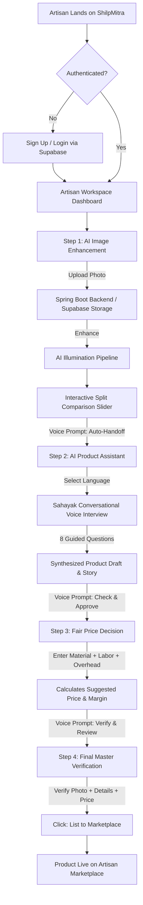
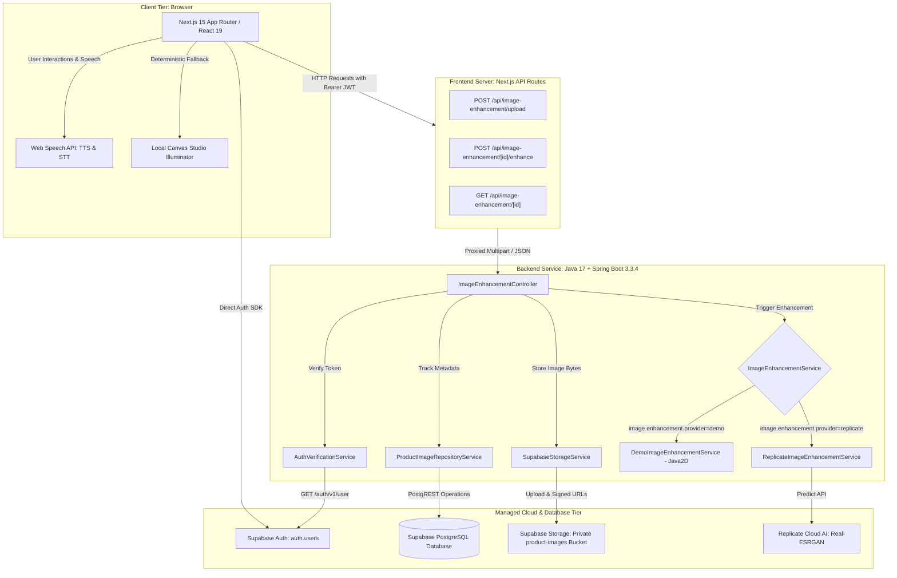
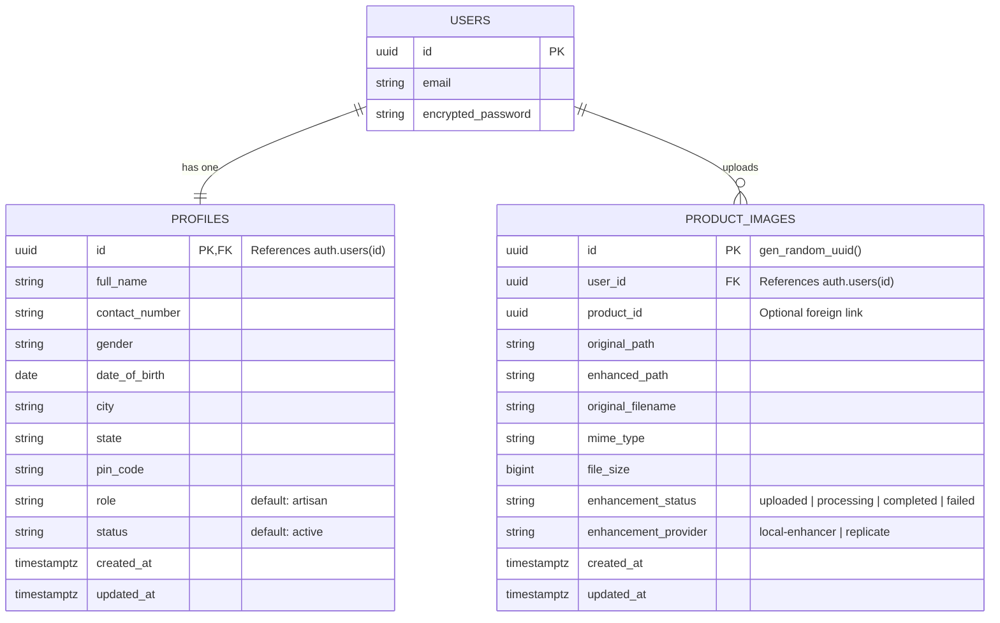
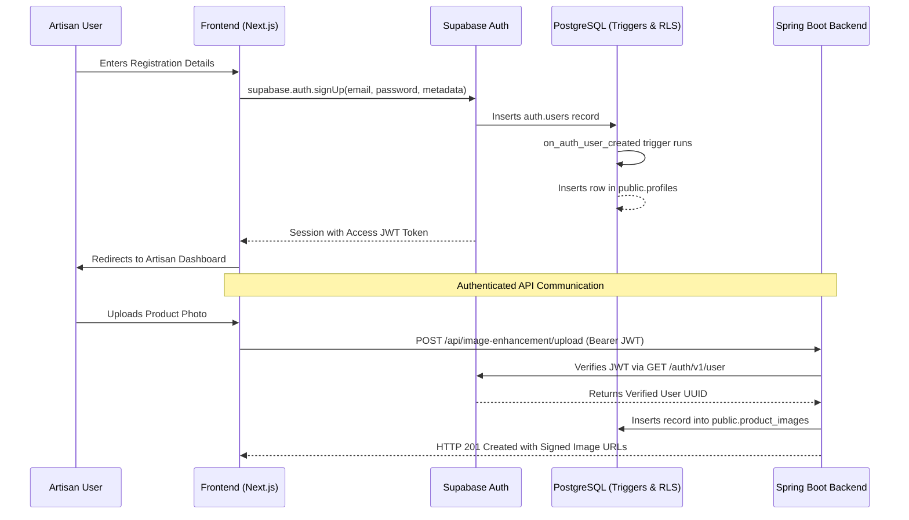

# ShilpMitra (शिल्पमित्र)

> **Your Craft. Your Story. Your Market.**  
> An AI-powered digital companion and inclusive commerce enablement platform empowering traditional Indian artisans, weavers, and craft creators to digitize, price, and sell their handcrafted creations.

---


---

## 📚 Table of Contents

- [📌 Project Overview](#-project-overview)
- [🎯 Problem Statement](#-problem-statement)
- [💡 Solution](#-solution)
- [✨ Features](#-features)
- [👥 User Roles](#-user-roles)
- [🔄 Complete Application Flow](#-complete-application-flow)
- [🏗️ System Architecture](#️-system-architecture)
- [🛠️ Technology Stack](#️-technology-stack)
- [📁 Project Structure](#-project-structure)
- [🎨 Frontend Architecture](#-frontend-architecture)
- [⚙️ Backend Architecture](#️-backend-architecture)
- [🗄️ Database Architecture](#️-database-architecture)
- [🔌 API Documentation](#-api-documentation)
- [🔐 Authentication & Authorization](#-authentication--authorization)
- [🔄 Important Technical Workflows](#-important-technical-workflows)
- [🔐 Environment Variables](#-environment-variables)
- [🚀 Installation & Setup](#-installation--setup)
- [▶️ Running the Application](#️-running-the-application)
- [📸 Screenshots / Demo](#-screenshots--demo)
- [🧪 Testing](#-testing)
- [🔒 Security Considerations](#-security-considerations)
- [☁️ Deployment](#️-deployment)
- [⚠️ Known Limitations](#️-known-limitations)
- [🔮 Future Scope](#-future-scope)
- [📊 Technical Decisions](#-technical-decisions)
- [🧑‍💻 Contributing](#-contributing)
- [👨‍💻 Contributors](#-contributors)
- [📄 License](#-license)

---

## 📌 Project Overview

**ShilpMitra (शिल्पमित्र)** is a full-stack digital enablement platform designed to bridge the digital divide for traditional Indian artisans. Many master artisans produce extraordinary handcrafted artifacts but lack the tools, language proficiency, and technical literacy required to navigate complex commercial e-commerce platforms.

ShilpMitra provides an intuitive, voice-first, multilingual workspace that guides artisans through every step of their digital journey:
1. **Studio Photo Enhancement**: Transforming workshop smartphone captures into marketplace-ready visuals using a dual-engine architecture (Spring Boot cloud AI and deterministic in-browser canvas illumination).
2. **Conversational Product Assistant (Sahayak)**: Conducting natural voice or text interviews in regional Indian languages to automatically synthesize structured marketing titles, artisan stories, and technical specifications.
3. **Fair Trade Price Valuation**: Calculating fair, cost-plus selling prices based on raw materials, artisan labor hours, and overheads to prevent commercial underpricing.
4. **Marketplace Cataloging**: One-click verification and publishing to an integrated digital artisan marketplace.

---

## 🎯 Problem Statement

```
Traditional Artisan Handcrafting
               ↓
Digital Exclusion & Literacy Barriers
               ↓
Underpricing & Middlemen Exploitation
               ↓
Need for an Inclusive, Voice-Guided Digital Companion
```

### The Real-World Challenge:
* **Sub-optimal Visual Presentation**: Artisans photograph products in dim workshops or outdoor stalls using low-cost smartphones. Without studio lighting, authentic colors and intricate micro-textures (hand-carving, weave patterns) appear dull or washed out.
* **Complex E-Commerce Onboarding**: Standard e-commerce seller portals require filling lengthy English forms, writing SEO descriptions, and tagging taxonomies—creating an insurmountable barrier for non-English-literate craft makers.
* **Underpricing & Unfair Valuation**: Artisans frequently underprice their work because they calculate only raw material costs, neglecting the grueling manual hours spent creating each piece.
* **Intermediary Dependency**: Because traditional makers cannot self-catalog, intermediaries and middlemen capture the vast majority of final market value.

---

## 💡 Solution

ShilpMitra addresses these challenges through a unified, warm, artisan-centric web application:

1. **Voice-Guided Navigation & Onboarding**: Browser-native Speech Synthesis (TTS) and Speech Recognition (STT) guide artisans verbally through every page, form, and tool in their preferred native language.
2. **Automated Visual Preservation & Enhancement**: Instead of hallucinating synthetic objects, the platform's enhancement pipeline lifts shadows, improves dynamic contrast, sharpens surface weave/carvings, and preserves authentic colors.
3. **Conversational Listing Engine**: Rather than facing a blank form, artisans converse with **Sahayak** through 8 simple questions (e.g., *"What materials did you use?"*, *"What is the heritage technique?"*), generating complete titles, descriptions, and discovery tags.
4. **Transparent Cost-Plus Pricing**: An interactive price calculator breaks down raw materials, artisan labor compensation, and workshop margins with transparent visual allocation bars.
5. **Direct-to-Market Handoff**: A streamlined verification flow that transitions smoothly from enhanced photo → AI description → fair price calculation → live marketplace listing.

---

## ✨ Features

### 👤 Artisan & User Features
* **Multilingual Voice Interaction (Sahayak)**: Full Text-to-Speech (TTS) guidance and Speech-to-Text (STT) input across 6 Indian languages: **Hindi, English, Marathi, Gujarati, Bengali, and Tamil**.
* **AI Image Enhancement Studio**:
  * Side-by-Side and Interactive Split-Slider comparison modes.
  * Preserves authentic craft weave, natural terracotta textures, and hand-carved grain.
  * Automatic local fallback if cloud AI endpoints or tokens are unavailable.
  * Direct download of enhanced high-resolution visuals.
* **Conversational AI Product Assistant**:
  * Voice-driven 8-question guided interview.
  * Intelligent answer extraction and skip-logic.
  * Dynamic generation of Product Titles, Craft Stories, Artisan Backgrounds, Short Summaries, and SEO Discovery Tags.
  * Full in-line editing and one-click draft regeneration.
* **Fair Trade Price Valuation**:
  * Slider-based entry for Raw Material Cost, Handcraft Labor Hours, and Overheads.
  * Dynamic artisan profit margin calculation with real-time cost breakdown bars.
  * Industry craft presets for Terracotta, Handloom Silk, Woodcraft, and Dhokra Bell Metal.
* **Artisan Marketplace & Catalog Management**:
  * Real-time product listing with stock tracking and status indicators (`Draft`, `Ready to Publish`, `Live on Marketplace`).
  * ONDC (Open Network for Digital Commerce) readiness badges.
* **Artisan Profile & Workshop Management**:
  * Basic Profile (Contact, Location, Demographic details).
  * Artisan Profile (Craft tradition, awards, generational heritage).
  * Business Profile (Workshop scale, production capacity, GST/PAN).

### ⚙️ System & Architectural Features
* **Dual-Engine Image Enhancement Pipeline**:
  * *Cloud Engine*: Java 17 / Spring Boot backend integrated with private Supabase Storage and Replicate Real-ESRGAN.
  * *Deterministic Local Engine*: In-browser HTML5 2D Canvas studio illumination, dynamic shadow lifting, and micro-texture sharpening.
* **BFF (Backend-for-Frontend) Proxy**: Next.js route handlers acting as an authenticated proxy forwarding Bearer tokens to the Spring Boot microservice.
* **State Synchronization**: Automatic state handoff via `localStorage` allowing fluid continuity between tabs (Photo Enhancement → AI Assistant → Price Decision → Marketplace).

### 🔐 Security & Identity Features
* **Supabase Authentication**: Secure email and password signup, login, session persistence, and password reset.
* **PostgreSQL Row Level Security (RLS)**: Enforced at database and storage bucket levels ensuring artisans access only their own records and images.
* **Zero Secret Leakage**: Strict separation of client-safe public keys (`NEXT_PUBLIC_`) and private backend tokens (`REPLICATE_API_TOKEN`, `SUPABASE_SERVICE_ROLE_KEY`).

---

## 👥 User Roles

| Role | Target Persona | Implemented Capabilities in Codebase |
| :--- | :--- | :--- |
| **Artisan / Craft Maker** | Traditional artisans, weavers, potters, self-help groups | Full access to voice companion, image enhancement, conversational listing generation, price analysis, product cataloging, and profile management. |
| **Evaluator / Reviewer** | College evaluators, hackathon judges, platform administrators | Access to demo showcase, marketplace previews, analytics metrics, and testing flows. |

---

## 🔄 Complete Application Flow



---

## 🏗️ System Architecture



---

## 🛠️ Technology Stack

| Layer | Technology | Version | Purpose in Project |
| :--- | :--- | :--- | :--- |
| **Frontend Framework** | Next.js | `15.1.7` | React App Router, Server Components & BFF API Routes |
| **UI Library** | React | `19.0.0` | Declarative, component-based user interface |
| **Language (Frontend)** | TypeScript | `^5.7.3` | Type-safe application development |
| **Styling** | Tailwind CSS | `^3.4.17` | Utility-first artisan color palette and responsive styling |
| **Icons** | Lucide React | `^1.16.0` | Crisp UI, action, and category iconography |
| **Animations** | Framer Motion | `^12.4.7` | UI transitions, scene micro-interactions, and modal animations |
| **Audio & Speech** | Web Speech API | Native | In-browser zero-latency Text-to-Speech (TTS) and Speech-to-Text (STT) |
| **Image Engine (Client)** | HTML5 2D Canvas | Native | In-browser deterministic studio lighting and sharpening fallback |
| **Backend Runtime** | Java | `17` | High-performance enterprise backend runtime |
| **Backend Framework** | Spring Boot | `3.3.4` | RESTful microservice, multipart handling, and AI coordination |
| **Image IO (Backend)** | TwelveMonkeys ImageIO | `3.10.1` | Extended Java image decoding for WebP formats |
| **JSON Serialization** | Jackson Databind | `2.17.2` | Fast JSON serialization/deserialization |
| **Database & Auth** | Supabase (PostgreSQL) | `15+` | User authentication, relational tables, and row-level security |
| **Object Storage** | Supabase Storage | Managed | Private cloud storage bucket (`product-images`) with signed URLs |
| **AI Vision (Cloud)** | Replicate API | Cloud | Super-resolution and micro-texture sharpening (`real-esrgan`) |

---

## 📁 Project Structure

```
d:/Shilpmitra/
├── .env.example                               # Reference environment variables
├── .gitignore                                 # Git ignore rules for secrets and build output
├── PRD.md                                     # Product Requirements Document
├── package.json                               # Frontend dependencies and npm scripts
├── package-lock.json                          # Pinned dependency lockfile
├── postcss.config.mjs                         # PostCSS configuration
├── tailwind.config.ts                         # Custom artisan color palette and typography
├── tsconfig.json                              # TypeScript configuration
│
├── backend/                                   # Java 17 + Spring Boot 3.3.4 Microservice
│   ├── pom.xml                                # Maven build definitions and dependencies
│   └── src/main/
│       ├── java/com/shilpmitra/backend/
│       │   ├── ShilpmitraBackendApplication.java # Spring Boot entry point
│       │   ├── config/                        # CORS, Supabase, and Replicate configurations
│       │   ├── controller/                    # ImageEnhancementController REST endpoints
│       │   ├── model/                         # Java DTOs and database mapping models
│       │   └── service/                       # Storage, auth verification, and AI services
│       └── resources/
│           └── application.properties         # Spring Boot server and external service configuration
│
├── public/                                    # Static assets, hero imagery, and sample craft photos
│   └── images/                                # Terracotta, handloom, brass, and woodcraft visuals
│
├── src/
│   ├── app/                                   # Next.js App Router
│   │   ├── layout.tsx                         # Root layout with metadata and fonts
│   │   ├── page.tsx                           # Public landing page
│   │   ├── globals.css                        # Global CSS variables and utility classes
│   │   ├── login/page.tsx                     # Artisan login page
│   │   ├── signup/page.tsx                    # Artisan registration page
│   │   ├── forgot-password/page.tsx           # Password recovery page
│   │   ├── api/image-enhancement/             # Next.js BFF proxy routes (upload, enhance, detail)
│   │   └── dashboard/                         # Authenticated artisan workspace
│   │       ├── page.tsx                       # Main tabbed dashboard orchestrator
│   │       ├── ai-product-assistant/page.tsx  # Conversational cataloging assistant
│   │       ├── image-enhancement/page.tsx     # Photo enhancement studio
│   │       ├── price-analysis/page.tsx        # Fair trade price calculation
│   │       ├── marketplace/page.tsx           # Live artisan marketplace
│   │       ├── products/page.tsx              # Workspace catalog management
│   │       ├── orders/page.tsx                # Customer order tracking
│   │       ├── sahayak/page.tsx               # Dedicated Sahayak companion center
│   │       ├── ads/page.tsx                   # Digital advertising & promotion
│   │       └── story-generator/page.tsx       # Craft heritage story generator
│   │
│   ├── components/                            # Modular React UI components
│   │   ├── auth/                              # LoginForm, SignupForm, ForgotPasswordForm
│   │   ├── dashboard/                         # Dashboard views, layout wrappers, and sidebar
│   │   ├── hero/                              # Landing page hero section and visual scenes
│   │   ├── features/                          # Landing page feature cards
│   │   ├── journey/                           # Craft-to-customer journey visualization
│   │   ├── sahayak/                           # Voice simulation and Sahayak dialogues
│   │   ├── navbar/                            # Header navigation and language selector
│   │   └── voice/                             # Floating voice companion widget
│   │
│   ├── data/                                  # Static reference data (states, navigation, journey)
│   ├── lib/                                   # Client utilities, Supabase client, and speech utils
│   │   ├── api/imageEnhancement.ts            # Client-side API caller for image operations
│   │   ├── supabase/client.ts                 # Browser Supabase client singleton
│   │   └── utils/
│   │       ├── localImageProcessor.ts         # In-browser HTML5 Canvas studio illuminator
│   │       └── speechUtils.ts                 # Web Speech API wrapper for 6 Indian languages
│   └── types/                                 # TypeScript interfaces and enum declarations
│
└── supabase/                                  # Database migrations and SQL setup
    ├── README.md                              # Supabase setup instructions
    ├── schema.sql                             # Master consolidated schema and triggers
    └── migrations/                            # Versioned SQL migrations (profiles, storage, RLS)
```

---

## 🎨 Frontend Architecture

The ShilpMitra frontend is built using **Next.js 15** with the **App Router**:

* **Rendering Strategy**: Landing page and static presentation sections utilize Server Components; interactive modules (Voice Assistant, Image Comparison Slider, Canvas Processor, Authentication forms) leverage `"use client"` directives.
* **Component-Based State Management**: State is localized within feature views (e.g., `ImageEnhancementView`, `AIProductAssistantView`) and synchronized across modules using `localStorage` keys:
  * `shilpmitra_selected_product_image`: Enhanced photo metadata.
  * `shilpmitra_active_product_draft`: Synthesized product draft.
  * `shilpmitra_analyzed_price`: Fair price calculations.
  * `shilpmitra_marketplace_products`: Published marketplace listings.
* **Voice-First Interaction**: `src/lib/utils/speechUtils.ts` encapsulates browser-native `SpeechSynthesis` and `SpeechRecognition`, mapping regional language codes (`hi-IN`, `mr-IN`, `gu-IN`, `bn-IN`, `ta-IN`, `en-IN`) without external paid audio APIs.
* **Warm Artisan Design System**: Configured in `tailwind.config.ts`, featuring warm artisan tones:
  * Backgrounds: `#FFF9F0` (Cream), `#FFFEFC` (Soft Canvas), `#FAF6EE` (Warm Card).
  * Accents: `#EA580C` / `#C2410C` (Terracotta Orange), `#059669` (Fair Trade Emerald).
  * Typography: Serif headings paired with clean sans-serif body typography.

---

## ⚙️ Backend Architecture

The backend is an independent Java 17 microservice built with **Spring Boot 3.3.4**:

```
Client / BFF Request
        ↓
ImageEnhancementController
        ↓
AuthVerificationService (Validates Bearer token with Supabase Auth)
        ↓
SupabaseStorageService (Stores byte stream in private bucket)
        ↓
ProductImageRepositoryService (Persists record via PostgREST)
        ↓
ImageEnhancementService (DemoImageEnhancementService / ReplicateImageEnhancementService)
        ↓
HTTP 200 / 201 Response with Signed URLs
```

* **Authentication Verification**: `AuthVerificationService` extracts the `Authorization: Bearer <token>` header and verifies it directly against `https://<supabase-url>/auth/v1/user`, extracting the verified `UUID` of the artisan.
* **Pluggable AI Enhancement Strategy**:
  * `DemoImageEnhancementService`: Java2D / `BufferedImage` processing that downloads original bytes, applies contrast adjustment (`1.14x`), lifts shadows (`+12`), enhances vibrance, applies unsharp masking, and re-encodes to PNG.
  * `ReplicateImageEnhancementService`: Formats predictions payload for `nightmareai/real-esrgan`, polls status via HTTP, and streams back enhanced image bytes.

---

## 🗄️ Database Architecture

The database is hosted on **Supabase (PostgreSQL 15+)** with Row Level Security (RLS) enabled on all tables:



### Storage Bucket:
* **`product-images`**: Private bucket with a 10MB file limit. Allowed MIME types: `image/jpeg`, `image/png`, `image/webp`. Objects are segmented by user folder: `{user_id}/originals/*` and `{user_id}/enhanced/*`.

---

## 🔌 API Documentation

### 1. Image Upload
* **Endpoint**: `POST /api/image-enhancement/upload`
* **Auth Required**: Yes (`Bearer <token>`)
* **Content-Type**: `multipart/form-data`
* **Request Parameter**: `file` (Binary Image File, max 10MB)
* **Response (HTTP 201 Created)**:
```json
{
  "id": "c1f7b8d4-5a3e-4d89-9a1b-3f4e5d6c7b8a",
  "originalPath": "9e38e70a-305f-4006-ac16-49b17153627c/originals/uuid_vase.jpg",
  "originalUrl": "https://<supabase-url>/storage/v1/object/sign/product-images/...?token=...",
  "enhancementStatus": "uploaded",
  "originalFilename": "terracotta_vase.jpg",
  "fileSize": 1450200
}
```

### 2. Trigger Image Enhancement
* **Endpoint**: `POST /api/image-enhancement/{imageId}/enhance`
* **Auth Required**: Yes (`Bearer <token>`)
* **Response (HTTP 200 OK)**:
```json
{
  "id": "c1f7b8d4-5a3e-4d89-9a1b-3f4e5d6c7b8a",
  "originalUrl": "https://<supabase-url>/storage/v1/object/sign/product-images/...original.jpg?token=...",
  "enhancedUrl": "https://<supabase-url>/storage/v1/object/sign/product-images/...enhanced.png?token=...",
  "status": "completed",
  "provider": "local-enhancer",
  "message": "Product image enhanced successfully."
}
```

### 3. Fetch Image Details
* **Endpoint**: `GET /api/image-enhancement/{imageId}`
* **Auth Required**: Yes (`Bearer <token>`)
* **Response (HTTP 200 OK)**:
```json
{
  "id": "c1f7b8d4-5a3e-4d89-9a1b-3f4e5d6c7b8a",
  "originalUrl": "https://<supabase-url>/storage/v1/object/sign/product-images/...original.jpg?token=...",
  "enhancedUrl": "https://<supabase-url>/storage/v1/object/sign/product-images/...enhanced.png?token=...",
  "enhancementStatus": "completed",
  "originalFilename": "terracotta_vase.jpg",
  "mimeType": "image/jpeg",
  "fileSize": 1450200,
  "createdAt": "2026-09-27T10:15:00Z"
}
```

---

## 🔐 Authentication & Authorization



* **Password Security**: Passwords are never handled or stored by the application server; they are hashed with bcrypt directly inside Supabase Auth.
* **Token Management**: Standard Supabase JWT access tokens (1 hour expiry) with automatic refresh.
* **Row Level Security (RLS)**: Enforced via `auth.uid() = user_id` across both PostgreSQL database queries and storage bucket file reads/writes.

---

## 🔄 Important Technical Workflows

### 1. Photo Capture to Studio Enhancement Workflow
1. **User Action**: Artisan drops a product photo into `ImageEnhancementView`.
2. **Audio Guidance**: Sahayak announces in Hindi: *"नमस्ते! कृपया अपने प्रोडक्ट की फोटो अपलोड करें ताकि हम इसे स्टूडियो क्वालिटी में बदल सकें।"*
3. **Processing**: Image is uploaded to backend, placed in private storage, and processed by the enhancement engine. If backend AI is unavailable, the in-browser Canvas engine executes deterministic enhancement.
4. **Handoff**: On completion, Sahayak announces completion and automatically stores the enhanced image in `localStorage` before redirecting to the AI Product Assistant.

### 2. Conversational Product Creation Workflow
1. **Language Choice**: Artisan selects one of 6 native languages.
2. **Interactive Interview**: Sahayak asks 8 structured questions one-by-one via voice.
3. **Voice Input**: Artisan clicks the microphone; browser `SpeechRecognition` transcribes spoken words directly into the answer box.
4. **Draft Synthesis**: On interview completion, the assistant generates titles, stories, short descriptions, and discovery tags.

### 3. Fair Price Determination Workflow
1. **Review**: Sahayak prompts: *"कृपया अपना प्रोडक्ट डिस्क्रिप्शन एक बार चेक कर लीजिए। अगर सब कुछ सही है, तो 'Approve & Go to Price Decision' बटन पर क्लिक करें।"*
2. **Cost Entry**: Artisan adjusts sliders for Material Cost, Labor Hours, Overheads, and Margin %.
3. **Calculation**: Real-time formula computes suggested retail price:
   $$\text{Total Cost} = \text{Material} + \text{Labor} + \text{Overhead}$$
   $$\text{Suggested Price} = \text{Total Cost} \times \left(1 + \frac{\text{Margin}}{100}\right)$$

### 4. Marketplace Publishing Workflow
1. **Master Review**: Full verification card displays studio photo, craft title, fair price, story, and stock count.
2. **Publishing**: Artisan clicks `🚀 List to Marketplace`. Product is stored in `shilpmitra_marketplace_products` with `Live on Marketplace` status.
3. **Confirmation**: Sahayak announces live status and offers direct navigation to the Marketplace view.

---

## 🔐 Environment Variables

The project utilizes environment variables across both the Next.js frontend and the Spring Boot backend. Reference values are defined in [`.env.example`](file:///d:/Shilpmitra/.env.example):

| Variable Name | Layer | Purpose | Required | Default / Example |
| :--- | :--- | :--- | :--- | :--- |
| `NEXT_PUBLIC_SUPABASE_URL` | Frontend & Backend | Public URL of your Supabase project | **Yes** | `https://your-project-id.supabase.co` |
| `NEXT_PUBLIC_SUPABASE_ANON_KEY` | Frontend & Backend | Public anonymous client API key | **Yes** | `sb_publishable_...` |
| `BACKEND_API_URL` | Frontend (Next.js) | URL of the Java Spring Boot service | **Yes** | `http://localhost:8080` |
| `IMAGE_ENHANCEMENT_PROVIDER` | Backend (Spring Boot)| AI Provider (`demo` or `replicate`) | No | `demo` |
| `REPLICATE_API_TOKEN` | Backend (Spring Boot)| Replicate API authentication token | Only if using Replicate | `r8_...` |
| `IMAGE_ENHANCEMENT_MODEL` | Backend (Spring Boot)| Replicate super-resolution model ID | No | `nightmareai/real-esrgan` |
| `SUPABASE_SERVICE_ROLE_KEY` | Backend (Spring Boot)| Elevated service key for backend admin tasks | No | `your-service-role-key` |

> ⚠️ **Security Notice**: Never commit `.env` or `.env.local` to source control. They are explicitly excluded in `.gitignore`.

---

## 🚀 Installation & Setup

### Prerequisites
* **Node.js**: `v20.x` or higher
* **npm**: `v10.x` or higher
* **Java Development Kit (JDK)**: `JDK 17`
* **Apache Maven**: `v3.8+`
* **Git**: Installed and configured
* **Supabase Account**: A free Supabase cloud project

### 1. Clone the Repository
```bash
git clone https://github.com/Dushyant13057/Shilpmitra.git
cd Shilpmitra
```

### 2. Configure Environment Variables
Create `.env.local` in the project root:
```bash
cp .env.example .env.local
```
Fill in your Supabase credentials obtained from **Supabase Dashboard → Project Settings → API**:
```env
NEXT_PUBLIC_SUPABASE_URL=https://your-project.supabase.co
NEXT_PUBLIC_SUPABASE_ANON_KEY=your-anon-key
BACKEND_API_URL=http://localhost:8080
IMAGE_ENHANCEMENT_PROVIDER=demo
```

### 3. Database & Storage Initialization
1. In your Supabase Dashboard, open the **SQL Editor**.
2. Run the migration script [`supabase/migrations/20260926000001_create_profiles.sql`](file:///d:/Shilpmitra/supabase/migrations/20260926000001_create_profiles.sql) to set up artisan profiles and auth triggers.
3. Run the migration script [`supabase/migrations/20260926000002_create_product_images_and_storage.sql`](file:///d:/Shilpmitra/supabase/migrations/20260926000002_create_product_images_and_storage.sql) to create the `product_images` table and the private storage bucket.

### 4. Install Frontend Dependencies
```bash
npm install
```

---

## ▶️ Running the Application

Running the full ShilpMitra platform locally requires starting both the backend service and the frontend dev server:

### Terminal 1 — Spring Boot Backend (Port 8080)
```bash
cd backend
mvn spring-boot:run
```
* Backend health check: Accessible at `http://localhost:8080`.

### Terminal 2 — Next.js Frontend (Port 3000)
```bash
# In the root Shilpmitra directory
npm run dev
```
* Frontend application: Open [http://localhost:3000](http://localhost:3000) in your browser.

---

## 📸 Screenshots / Demo

> Craft visuals and demonstration assets are located in [`public/images/`](file:///d:/Shilpmitra/public/images/):

| Visual Asset | Description |
| :--- | :--- |
| `public/images/pot-before.jpg` | Workshop capture of artisan pottery prior to enhancement |
| `public/images/pot-after.jpg` | Studio-quality enhanced visual with balanced illumination |
| `public/images/terracotta-craft.jpg` | Heritage terracotta vase craft product |
| `public/images/wood-handicraft.jpg` | Hand-carved wooden keepsake artifact |
| `public/images/craft-weaving.jpg` | Traditional handloom weaving capture |
| `public/images/craft-brass.jpg` | Dhokra lost-wax bell metal figurine |

---

## 🧪 Testing

* **Backend Unit & Integration Tests**: Spring Boot includes `spring-boot-starter-test` dependencies in `backend/pom.xml`. Tests can be executed using:
  ```bash
  cd backend
  mvn test
  ```
* **Frontend Verification**: TypeScript type-checking and Next.js linting can be verified using:
  ```bash
  npm run lint
  npx tsc --noEmit
  ```
* *Automated End-to-End (E2E) test suite is not currently included in the repository.*

---

## 🔒 Security Considerations

* **Bcrypt Password Encryption**: User passwords are encrypted and managed strictly by Supabase Auth; cleartext passwords never touch application servers.
* **Row-Level Security (RLS)**: Enforced via PostgreSQL policies (`auth.uid() = user_id`) preventing artisans from accessing or modifying another artisan's profiles or product images.
* **Storage Isolation**: Images in the Supabase Storage `product-images` bucket are strictly isolated into per-user directories (`{user_id}/*`). File access is protected via time-limited signed URLs (1800s to 3600s expiry).
* **MIME-Type & File Size Validation**: Dual-layer validation (Next.js route handler and Spring Boot controller) restricts uploads to `image/jpeg`, `image/png`, and `image/webp` under a strict 10MB ceiling.
* **CORS Protection**: Spring Boot `CorsConfig` limits cross-origin resource sharing to permitted frontend origins.

---

## ☁️ Deployment

```
[User Browser]
       │
       ▼
[Next.js App Server / Vercel] ────► [Supabase Managed Cloud]
       │                                  │
       ▼                                  ├─ PostgreSQL (Profiles, Images)
[Spring Boot Backend / VM / Container]   ├─ Auth (JWT, Sessions)
       │                                  └─ Storage (Private S3 Bucket)
       ▼
[Replicate AI Cloud (Optional)]
```

* **Frontend**: Next.js App Router application ready for deployment on Vercel, AWS Amplify, or Node.js Docker containers.
* **Backend**: Containerizable Spring Boot JAR (`mvn clean package`) executable on any cloud VM (Render, Railway, AWS ECS, Google Cloud Run) with Java 17 runtime.
* **Database & Storage**: Fully managed on Supabase Cloud.

---

## ⚠️ Known Limitations

1. **Browser Web Speech API Support**: The voice assistant relies on the W3C Web Speech API (`SpeechSynthesis` and `webkitSpeechRecognition`). While supported out-of-the-box on modern Chrome, Edge, and Safari, recognition support may vary on certain Linux distributions or older browsers.
2. **Replicate API Credits**: Using the cloud AI enhancement provider (`IMAGE_ENHANCEMENT_PROVIDER=replicate`) requires a funded Replicate API token. If credits expire, the system automatically falls back to the deterministic local studio engine.
3. **ONDC Integration Scope**: The current marketplace interface includes ONDC readiness schemas and catalog verification; live ONDC protocol beckn gateway network transactions are in the demonstration/MVP stage.

---

## 🔮 Future Scope

```
Current Implementation                      Future Enhancement
─────────────────────────────────────────────────────────────────────────────
Browser Web Speech API             ──►      Custom Fine-Tuned Indic Whisper STT
Desktop & Mobile Web App           ──►      Offline-First PWA & React Native App
Demo ONDC Verification Badges      ──►      Live Beckn Protocol Gateway Integration
Local/Replicate Image Enhancement  ──►      Edge-deployed WebAssembly Super-Resolution
Manual Raw Cost Entry              ──►      Computer-Vision Assisted Material Estimation
```

---

## 📊 Technical Decisions

### Why Next.js 15 App Router?
The architecture uses Next.js 15 for its unified developer experience, combining fast React 19 server-rendered marketing sections with client-side interactive voice modules and built-in BFF API routes that prevent exposing backend microservice topology to the public internet.

### Why Spring Boot (Java 17) for Image Processing?
Spring Boot provides robust multi-part file streaming, enterprise exception handling, and native image manipulation libraries (`TwelveMonkeys ImageIO`, `BufferedImage`, `Graphics2D`) capable of high-throughput byte processing without blocking the Node.js event loop.

### Why Supabase PostgreSQL & Row Level Security?
Supabase offers an integrated ecosystem combining PostgreSQL, Auth, PostgREST, and S3-compatible storage. Enforcing RLS directly in SQL guarantees multi-tenant artisan data isolation even across distributed microservices.

### Why Browser-Native Web Speech API?
Artisans frequently operate in bandwidth-constrained rural environments. Using browser-native speech synthesis and recognition delivers instant, zero-cost, zero-latency voice interaction without requiring expensive per-second third-party cloud audio streaming subscriptions.

---

## 🧑‍💻 Contributing

Contributions are welcome! Please follow these steps:

1. **Fork the Repository** on GitHub.
2. **Create a Feature Branch**:
   ```bash
   git checkout -b feature/amazing-feature
   ```
3. **Commit your changes**:
   ```bash
   git commit -m "feat: add amazing artisan capability"
   ```
4. **Push to the branch**:
   ```bash
   git push origin feature/amazing-feature
   ```
5. **Open a Pull Request** describing your additions and testing verification.

---

## 👨‍💻 Contributors

* **Dushyant Sharnagat** ([@Dushyant13057](https://github.com/Dushyant13057)) — *Lead Developer & Architect*

---

## 📄 License

*No license file is currently included in the repository. All rights reserved by the author.*